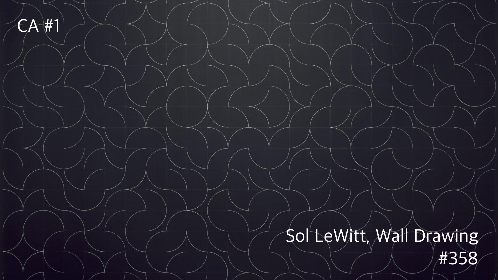
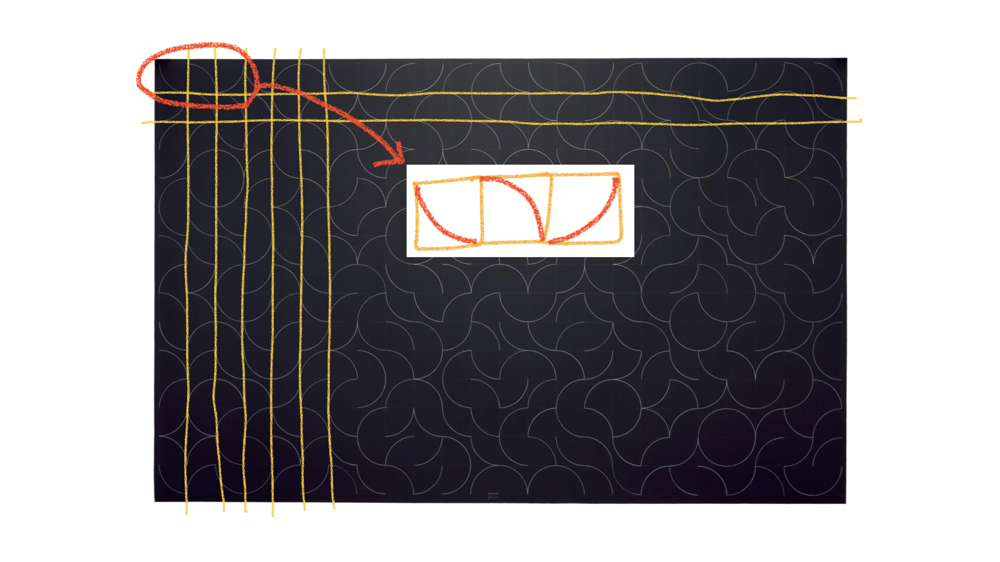
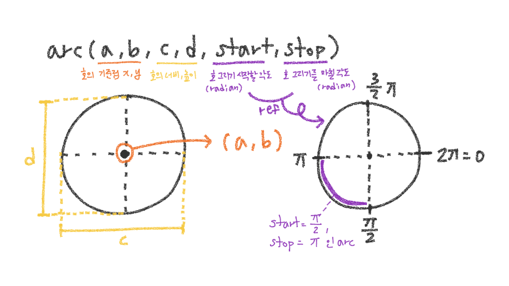
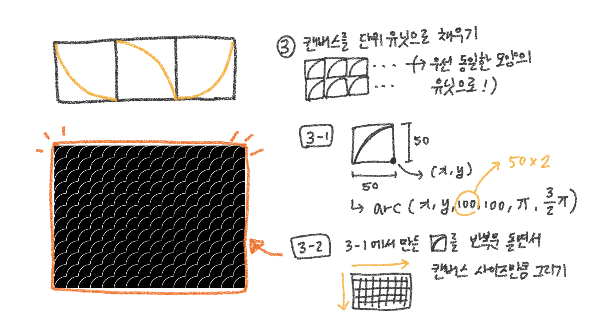
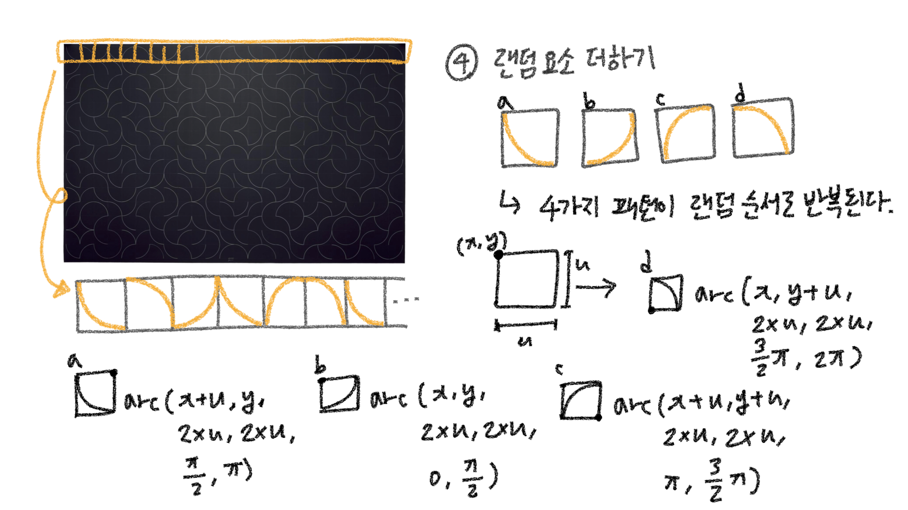
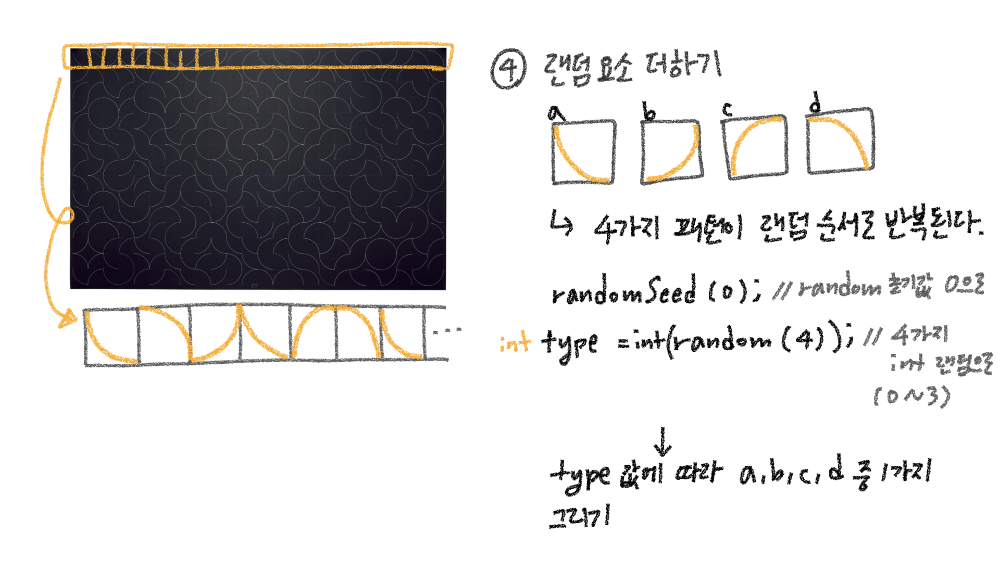

# Recall Point

- arc() 에서 각 파라미터가 의미하는 바
- Processing 시스템에서 각도 표시법 (0, π/2, π, 3/2*π, 2π)
- Sol LeWitt's Wall Drawing #358 구현 스텝

---

# Notes




### 사용할 함수

- `arc()`
- `random()`
- `randomSeed()`








```java
void setup() 
{ 
  size(800, 600); 
  noFill(); 
  stroke(255); 
  background(0);
}

void draw() 
{
  int unitSize = 50;
  int arcSize = unitSize * 2;
  
  for (float y = 0; y < height; y += unitSize) {
    for (float x = 0; x < width; x += unitSize) {
			arc(x + unitSize, y + unitSize, arcSize, arcSize, PI, PI + HALF_PI);
    }
  }
}
```



```java
// type a
arc(x + unitSize, y, arcSize, arcSize, HALF_PI, PI);
          
// type b
arc(x, y, arcSize, arcSize, 0, HALF_PI);
          
// type c
arc(x + unitSize, y + unitSize, arcSize, arcSize, PI, PI + HALF_PI);
          
// type d
arc(x, y + unitSize, arcSize, arcSize, PI + HALF_PI, TWO_PI);
```




```java
void setup() 
{ 
  size(800, 600); 
  noFill(); 
  stroke(255); 
  background(0);
}

void draw() 
{
  int unitSize = 50;
  int arcSize = unitSize * 2;
  
  // 랜덤 초기화 - 초기값 0으로 설정
  randomSeed(0);
  
  for (float y = 0; y < height; y += unitSize) {
    for (float x = 0; x < width; x += unitSize) {
 
      int type = int(random(4));
      
      switch (type) {
        case 0:
          // type a
          arc(x + unitSize, y, arcSize, arcSize, HALF_PI, PI);
          break;
        case 1:
          // type b
          arc(x, y, arcSize, arcSize, 0, HALF_PI);
          break;
        case 2:
          // type c
          arc(x + unitSize, y + unitSize, arcSize, arcSize, PI, PI + HALF_PI);
          break;
        case 3:
          // type d
          arc(x, y + unitSize, arcSize, arcSize, PI + HALF_PI, TWO_PI);
          break;
      }
    }
  }
}
```

### References

[Sol LeWitt, Wall Drawing No. 358: A 12 (30 cm) Grid Covering the Wall. Within Each 12 (30 cm) Square, One Arc from the Corner. (The direction of the arcs and their placement are determined by the draftsman.), 1981](https://mcachicago.org/Collection/Items/1981/Sol-Le-Witt-Wall-Drawing-No-358-A-12-1981)