 지난 1월 싱가포르에서 열린 JSConf.Asia 2018에 팀원들과 다녀왔습니다. 첫째/셋째 날에는 세션, 둘째 날에는 워크샵으로 구성된 3일간의 일정이었습니다.

 자세한 일정은 [공식 홈페이지](https://2018.jsconf.asia/)에서 확인하실 수 있고, 첫째 날 Code in the dark 이벤트와 둘째 날 워크샵들 이외에 모든 세션은 [JSConf youtube 채널](https://www.youtube.com/channel/UCzoVCacndDCfGDf41P-z0iA)에 속속 올라오고 있습니다. 

---

## '커뮤니티'를 위한 컨퍼런스

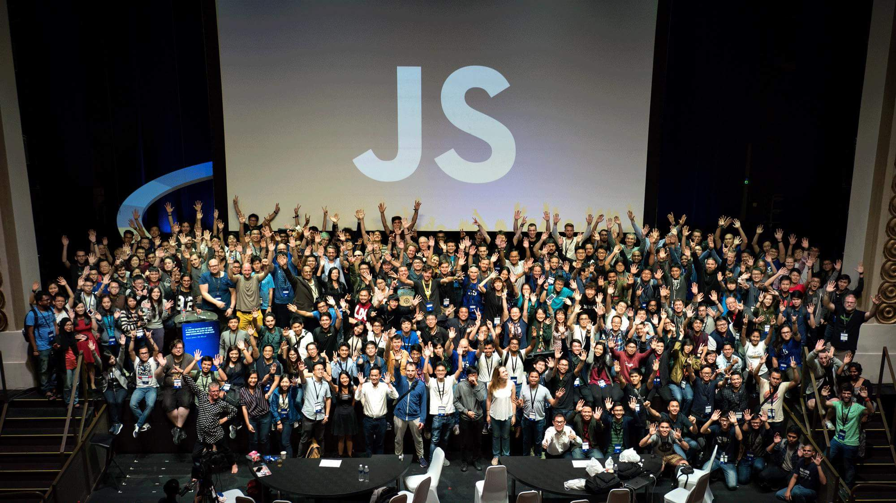

 컨퍼런스라는 게 사실 세션들에서 '배우러' 간다기보다는 네트워킹 하러 가는 거라고들 하지만, 국내 컨퍼런스에서는 네트워킹이 실제로 엄청 활발히 이루어지기보다는 세션 자체에서 얼마큼 배울 수 있는 지가 중요하게 느껴지는 때가 많았는데요(물론 모든 컨퍼런스가 그렇다는 건 아니지만). JSConf.Asia는 오프닝부터 줄기차게, 대놓고 '**좋은 사람들을 만날 수 있는 곳**'으로써 컨퍼런스의 가치를 말하는 게 인상적이었습니다.

 사전에 컨퍼런스 참여자들에게서 받은 설문에서도 이 컨퍼런스에 참여하는 목적 중 가장 많은 응답이 'best place to meet great people' 였고, 오거나이저들은 점심시간이나 커피타임을 안내할 때마다 아예 같이 온 친구들이랑 놀지 말고 새로운 사람들이랑 얘기하라고 공지(?)처럼 말하곤 했거든요. Code in the dark나 워크샵을 포함한 컨퍼런스 내 여러 이벤트들도 지식적인 걸 더 많이 배우기보다는 더 많이 '서로를' 알고 이야기하고 즐길 수 있도록 하기 위해 기획된 것으로 보였구요. 그렇게 실제로 기획된 것들에는 아래와 같은 게 있었고, 이 컨퍼런스의 목표는 '커뮤니티'를 만들고 서로 공감하는 데에 있구나 싶은 때가 많았습니다.

### 1 오프닝 퀴즈쇼 JavaScript Feud

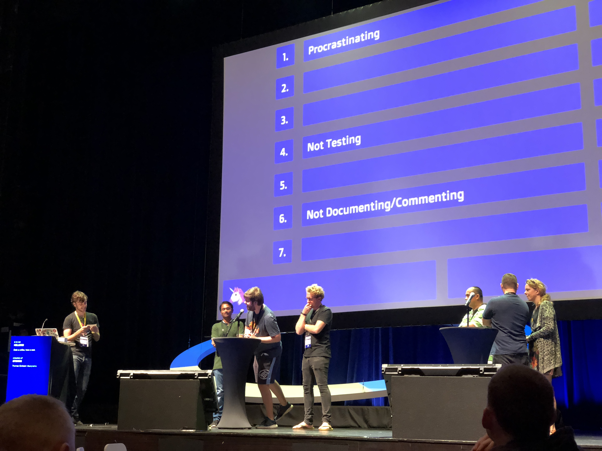

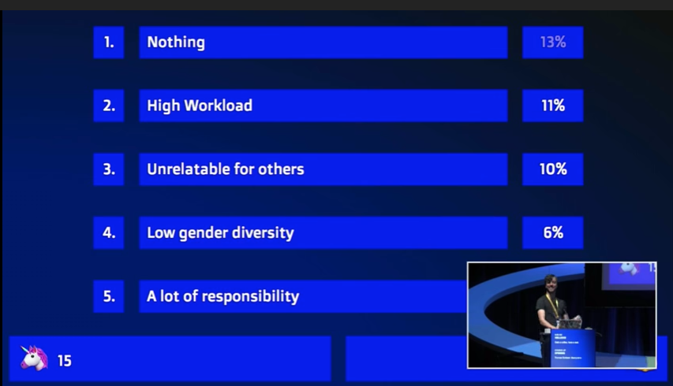
<figcaption>개발자라는 걸 슬프게 하는 이유가 있다면?</figcaption>

 특이하게 오프닝에서 퀴즈쇼를 진행하였는데요. 컨퍼런스 신청할 때같이 답변을 받았던 설문 내용을 질문으로 만들어서, 참가하고 싶은 사람은 무대 위로 올라가서 참가하는 식이었습니다. 개발자들이면 공감&재밌게 볼 질문들이 많아서 앉은 자리에서도 맞춰보거나 답이 나왔을 때 오 맞아맞아 하거나 하면서 봤어요.

> 요런 질문들이 있었습니다.     
>  Q. 가장 최근에 내가 진행한 프로젝트에는 너무 많은 ____ 가 있었다.   
>  Q. 나의 가장 안 좋은 코딩 습관은?    
>  Q. 개발자라는 걸 슬프게 하는 이유가 있다면?    
>  Q. 나는 ____ 할 때 가장 일이 잘 된다.    
>  Q. 일주일 동안 마시는 커피 수는?    
>  Q. 새로 프론트엔드를 구성할 때 나는 ____ 를 쓴다.    

### 2 Code in the dark

<iframe width="544" height="306" src="https://serviceapi.nmv.naver.com/flash/convertIframeTag.nhn?vid=2EB2EC24DC3FBED23F184942ABB4CE7E0336&outKey=V125b1bf05e1f017f2a2d84e49b65315d787cfa22a438f9f108e984e49b65315d787c" frameborder="no" scrolling="no" title="NaverVideo" allow="autoplay; gyroscope; accelerometer; encrypted-media" allowfullscreen></iframe>

<figcaption>세상에서 가장 건전한 클럽 이벤트</figcaption>

 Code in the dark는 JSConf와 별도로 정기 개최되는 이벤트입니다. 이번에는 시기를 맞추어서 제휴(?) 식으로 함께 개최한 것 같아요. Code in the dark 자체는 싱가포르 이외에 다른 나라들에서도 열리는 이벤트입니다. 자세한 내용은 [공식 홈페이지](http://codeinthedark.com/)를 참고해주세요.

 간단하게는 이렇습니다.    

- 완성된 웹페이지 스크린샷만 보고
- 15분 동안
- HTML/CSS 코드 편집 창만 보고(preview 없이) 최대한 똑같이 만들어서
- 가장 똑같이 만든 한 사람이 이기는 토너먼트 형식의 이벤트

 컨퍼런스 안내 메일로 전송된 링크를 통해서 미리 참가신청을 할 수 있었고, 현장에서 토너먼트 표가 짜였습니다. 클럽에서, 체크무늬 셔츠를 챙겨 입은 개발자들과 함께, 매우 건전하게 진행되었어요. 참고로 지난해 우승자는 table로 레이아웃 짜고, 인라인 스타일로 모두 때려 박아서 결승까지 진출하여 우승 상품을 따갔다고 하더랍니다. 정말 재미로 하는 이벤트라 코드의 품질이라든지 이런 건 전혀 상관없고 무조건 이미지랑 가장 똑같이 보이게 만들면 이기는 게임이었어요. 그런 와중에 [공식 에디터](https://github.com/codeinthedark/editor)까지 만들어서 사용하더라구요!

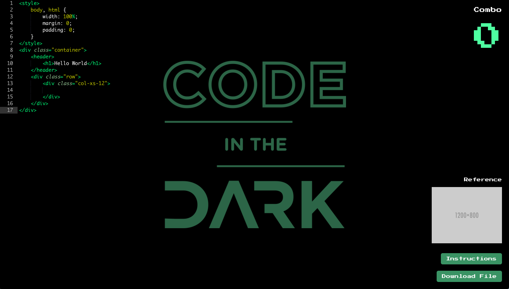
<figcaption>요것이 공식 에디터 화면</figcaption>

### 3 워크샵 데이

<iframe width="544" height="306" src="https://serviceapi.nmv.naver.com/flash/convertIframeTag.nhn?vid=6273A67567170AC116307F71BA1768048726&outKey=V123fb0c8db601d8c4276ba6b3d1a47100729e3830d2f69827804ba6b3d1a47100729" frameborder="no" scrolling="no" title="NaverVideo" allow="autoplay; gyroscope; accelerometer; encrypted-media" allowfullscreen></iframe>

<figcaption>워크샵 데이 : 컨퍼런스장과 떨어져 있는 센토샤 리조트로 이동해서 오전/오후 워크샵 및 네트워킹 타임</figcaption>

 워크샵 데이는 주최 측이 이번 컨퍼런스에서 새롭게 시도한 프로그램이었습니다. 컨퍼런스 오거나이저인 Thomas가 오프닝에서 했던 말에 따르면, 2016년 JSConf.Asia를 개최했을 때 (2017년에는 JSConf.Asia가 개최되지 않았습니다) 받은 피드백 중 가장 많았던 것이 "컨퍼런스 세션들 좋긴 했는데, 3일 동안 스피커들 얘기 듣기만 하고 서로 알 시간이 없는 것 같다." 여서, 올해는 아예 두 번째 날을 Community&Workshop day로 만들었다고 하더라구요.

 컨퍼런스가 시작되기 이전에 각자 참여할 워크샵을 온라인으로 신청하여 워크샵 데이에서 신청했던 곳을 찾아가는 방식이었습니다. 다양한 워크샵이 있었는데, 저는 오전에는 Chen Hui Jing의 CSS Grid, 오후에는 Vanessa Radd이 진행한 Augmented City에 참여하였습니다.

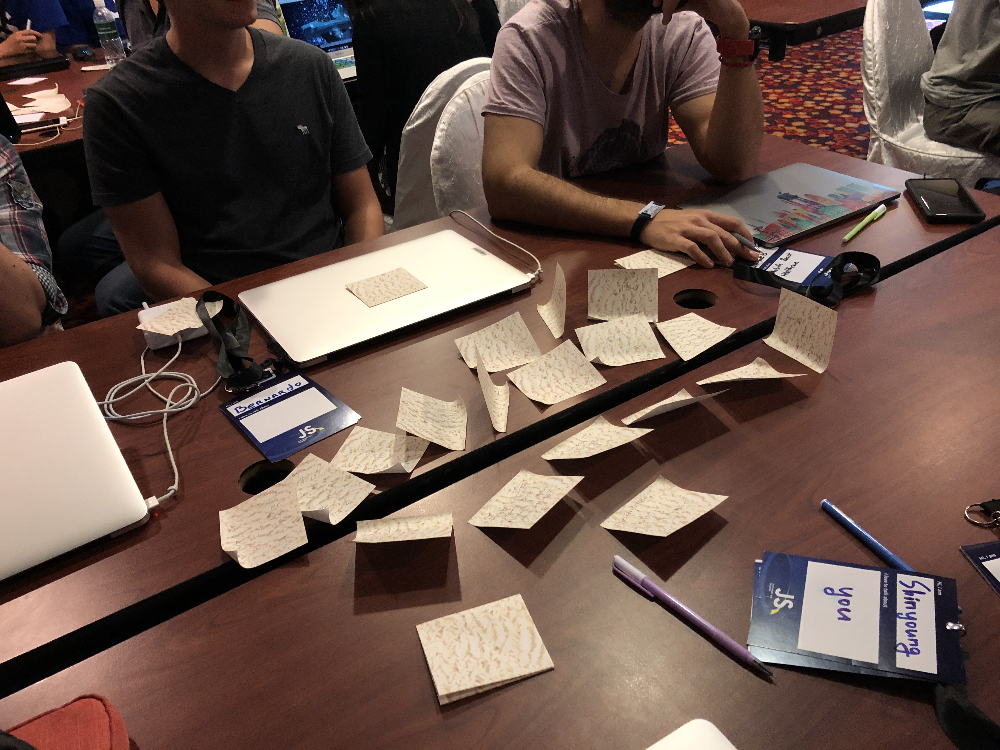
<figcaption>AR을 어떤 아이디어를 구현하는 데에 쓰면 재밌을지 생각나는 대로 다 적고, 비슷한 아이디어들끼리 모아봅니다.</figcaption>

 Augmented City 워크샵에서는 팀을 짜서 아주 간단한 AR 어플리케이션을 만들어보았는데요. 짧은 시간이긴 하지만 브레인스토밍을 하고, 아이디어들을 생각나는 대로 다 포스트잇에 적으면서 얘기한 다음, 그중에 어떤 아이디어를 우리 팀 기획으로 잡을지 논의하는 과정까지 있어서 초미니 해커톤 같은 느낌이었어요. 개발할 때에는 [glitch](https://glitch.com/)라는 페이지에서 실시간으로 같은 화면을 공유해서 보면서 얘기하기도 했습니다.

 시간이 워낙 짧아서 정작 AR개발 자체는 완전 예제 돌려보는 정도였던 게 조금 아쉬웠지만 기획한 취지 그대로 세션들을 들을 때보다는 훨씬 자연스럽게 주변 사람들과 이야기할 기회들이 있어서 재밌었습니다. 국내 컨퍼런스에서 잘 운영하지 않는 종류의 프로그램이기도 하고요. 그리고 한편으로는 왜 그렇게 컨퍼런스 티켓을 비싸게 받았는지 이해되는 리조트 수준..

### 4 라이트닝 토크

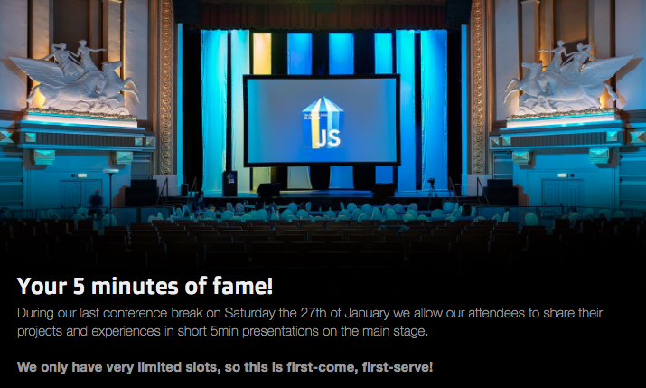

 마지막 날 세션 사이에는 쉬는 시간을 겸해서 라이트닝 토크(Lightning Talk)가 있었는데요. 사전에 신청을 받아서, 5분 정도의 짧은 시간 동안 자신의 프로젝트를 소개하거나, 그냥 간단하게 공유하고 싶은 주제가 있는 경우 어떤 것이든 공유할 수 있도록 하는 자리였습니다. [신청 페이지](https://jsconfasia.wufoo.eu/forms/your-5-minutes-of-fame/) 자체에도 'Your 5 minutes of fame!'이라고. 쉬는 시간에 이루어지는 거라 자유롭게 커피를 마시러 오가기도 하고, 컨퍼런스 장 바깥에도 스크린이 있어서 바깥에서 얘기하면서 스크린으로 보기도 했습니다.

 이번 컨퍼런스에서 리액트에 대해 발표한 스피커도 작년 JSConf에서 라이트닝 토크에 참여했던 경험이 있는 것으로 보아, 요런 기회들을 만들어서 컨퍼런스 자체를 지속하는 데에도 (참가자/스피커/오거나이저 모두) 도움이 될 수 있도록 하는 것 같아요.

### 5 다양한 참가자 확보를 위한 사전 작업

 좋은 커뮤니티를 구성하는 것 자체가 JSConf에서 추구하는 가장 큰 목표이기 때문에, 오거나이저들은 컨퍼런스에 참가하는 사람들의 성비나 출신 등을 최대한 다양하고 조화롭게 구성하는 데에 가장 많은 공을 들인다고 합니다. 로컬 커뮤니티를 찾아서 티켓을 뿌리면서 컨퍼런스 참가를 권유하기도 하고, 스피커를 찾는 것도 그렇구요. 그래서인지 JSConf지만 참가자들 중에서 Java 백엔드, QA, 심지어 코볼(..!!) 프로그래머까지 만나볼 수 있었습니다.

## "Tweet me!" - 커뮤니티 활동은 트위터에서

 저는 트위터를 제대로 써본 적이 없습니다. 트위터는 뭐랄까... 쓰더라도 굳-이 내 계정을 동네방네 밝히고 싶은 생각은 안 드는 그런 곳...? 의 느낌인데요ㅎㅎㅎ. 단적으로 제 안에서 트위터는 짤줍용이거나, 각종 용도의 덕질용, 아니면 그냥 아무말, 제 2의 인격체, 아니면 뭐 이런거.. 

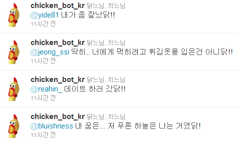
<figcaption>트위터봇으로 구글에 검색하니 이런 것들이 나왔습니다...</figcaption>

 그런데 컨퍼런스에 오니, 세션이 끝날 때마다 듣는 말이 있었습니다 "If you have any questions, tweet me!". 다시 홈페이지를 보니, 아예 공식 홈페이지에도 스피커마다 트위터 계정을 달아두었더라구요.  

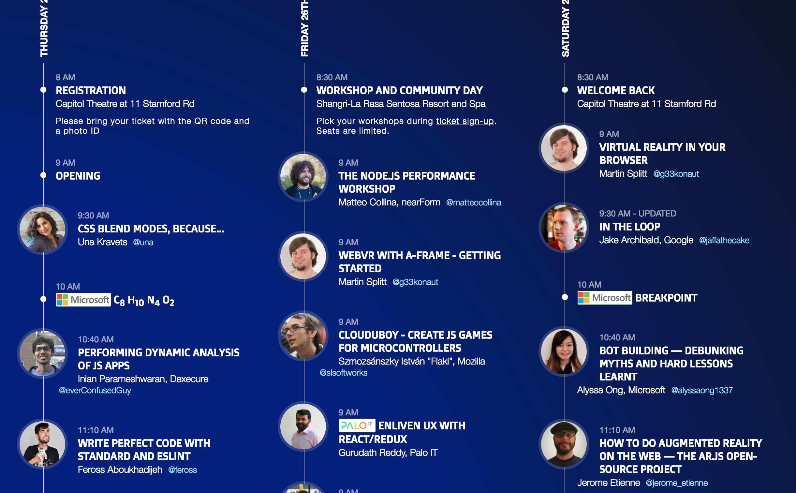

 네트워킹 시간에 얘기할 때도 모두가 초장부터 물어보는 게 "트위터 해?", "트위터 계정 뭐야?", "트위터로 연락할게" 였구요. ~~트위터 안하는 사람 속상해서 살겠나..~~
 사실 이번에 컨퍼런스를 다녀오면서 가장 의외였던 부분이 해외에서 트위터를 굉장히 official한 용도로 사용하고 있다는 것이었는데요. '**컨퍼런스에서 만들어진 커뮤니티를 이어가는 곳**'으로 모두가 트위터를 쓰고있는 것처럼 보였습니다. 연락할 방법을 물어보면 열에 아홉은 트위터 계정을 알려주었고, (메일이나 페북이나 인스타를 알려줄 줄 알았는데 모두 아니었다고 한다...) 개발 관련 질문도 트위터에서, 어떤 주제에 관심있다고 하면 “아 그럼 이 사람 트위터 팔로잉 해봐”라는 답이 돌아왔어요. 명함도 쓰는 사람들이 있긴 했으나 높은 확률로 "누가 요즘 명함을 가지고 다녀?!"라는 말을 들을 수 있습니다ㅠㅜ 트위터 계정 파서 가세여 여러분..

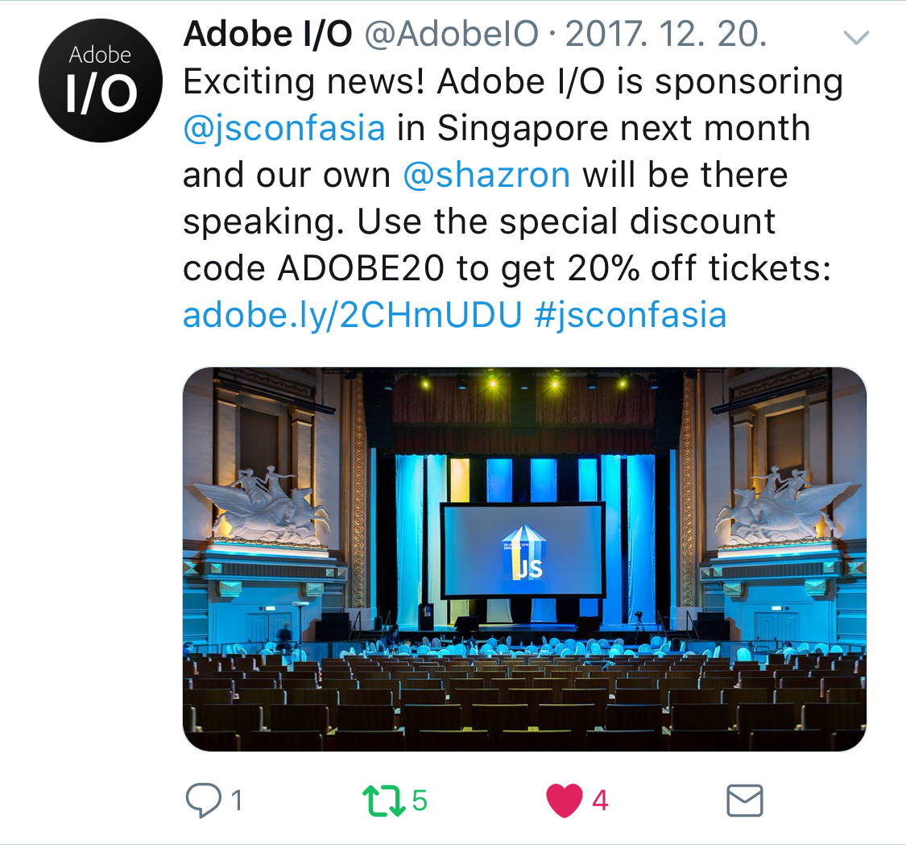
<figcaption>"우리가 JSConf Asia 스폰서고 발표도 할거야. 이 코드 쓰고 20% 할인받아서 티켓 사서 오렴"</figcaption>

 JSConf Asia에서의 경험이지만, 참가한 사람들 자체는 꽤 전세계(아이슬란드/영국/독일/스페인/인도/호주/홍콩/태국/싱가포르/미국 등등)에서 왔다는 걸 생각해봤을 때 이 컨퍼런스에서만 유독 트위터를 쓰는 건 아닌 것 같습니다. 컨퍼런스 티켓 자체도 Adobe가 자기네 팀에서 스피커가 간다는 공지를 올리면서 할인 코드를 뿌리기도 하고, 실제로 위에서 얘기했던 다양성 확보를 위해 컨퍼런스 오거나이저 측에서 로컬 커뮤니티를 찾아서 할인코드/티켓을 뿌리려고 한다는 데에도 트위터를 통하는 경우가 꽤 있는 것 같아요.

## 즐겁게 성장하기 위한,

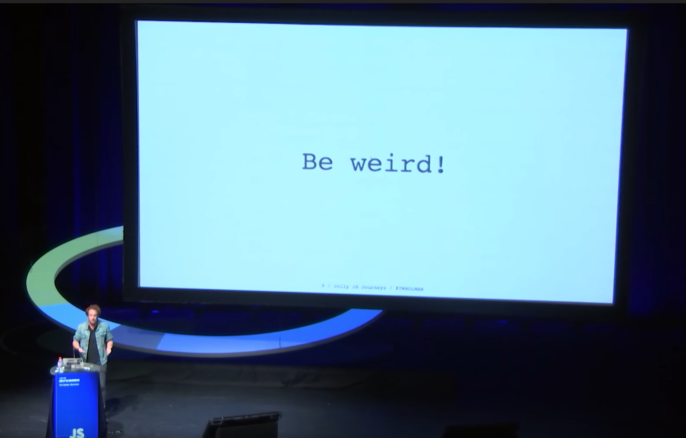
<figcaption>Jolly JS Journeys(https://www.youtube.com/watch?v=iGPzwotXgfk)</figcaption>

 '배움'이라는 측면에서는, 솔직히 실망스러운 세션들도 많았습니다. '저 정도는 인터넷 찾아보면 문서로 다 나와있는 개요 정도 아니야?' 싶은 것들도 있었고, 정말로 재미삼아 만들어본 쓸모는 없는 것들을 모아서 발표하기도 했고(그리고 재밌었습니다) 뭔가 과학상자로 만든 느낌의 로봇들을 가지고 올라왔는데 제대로 동작하지 않는 경우도 있었어요(하지만 껄껄껄 웃고 끝났습니다). 그래서 컨퍼런스 당일에는 'JSConf인데.. 뭔가 좀 실망이다'라는 생각이 들 때도 있었고 그렇게 얘기하기도 했는데요. 우리나라에서 컨퍼런스에 갔을 때 오히려 '와...저런 걸 어떻게 하지' 싶은 것들이 많았던 것 같았거든요.

 그런데 돌아와서 생각해보니 내가 자기검열하듯 하는 걸 그 스피커들에게 똑같이 하고 있는 건 아니었나-싶어졌습니다. 사실 글을 쓰거나, 발표를 하려고 할 때마다 '이정도는 어차피 다른 사람들도 다 아는 거 아닐까', '말도 안되게 틀린 얘기하는 거 아냐?', ‘괜히 쓸데없는 거 공유하는 거 아냐?’하는 걱정이 끊이질 않습니다. 개인적으로 만드는 것/만들고 싶은 것들을 공개하는 것도 부끄러울 때가 많구요. 그러지 않으려고 하는데, 성향인지 고치기는 쉽지 않고 일을 시작한 이후로는 점점 더 어렵게 느껴지기도 합니다.

 주변의 친구들과 이야기해보면서 이게 의외로 저만의 걱정은 아닌 때가 많다는 것도 알았는데요. 그러고나니 그냥 누군가는 '뭐 저런 걸 여기까지 와서 발표해?'라고 할 법한 것들도 신나게 발표하고, 좀 더 가볍고 즐거운 분위기에서 서로 만든 걸 공유하는 장이 더 필요하겠구나 싶습니다. 제가 처음에 갸우뚱했던 JSConf처럼요.

 JSConf의 스피커들이나, 커피타임/워크샵에서 만난 사람들은 대체로 지금 하고 있는 프로젝트가 얼마나 즐거운지, 간단히 이런 걸 만들어봤는데 정말 재밌고 예뻤다든지 하는 이야기를 하곤 했습니다. 지금 하는 게 기술적으로 얼마큼 대단하고, 복잡한지를 이야기하기보다는요. 물론 한편으로는 여전히 비싼 티켓값만큼 최소한의 세션 퀄리티는 중요하지 않을까 싶기도 합니다. 그리고 이런 컨퍼런스에만 맛들려서 애초에 깊이 있는 경험은 없는데 말만 번드르르한 사람이 많은 것일 수도 있구요.

 하지만 깊은 기술을 이야기하는 장은 그대로, 커뮤니티를 위한 장은 또 이대로 있는 것도 좋을 것 같습니다. 누군가 ‘겨우 이런거?’라고 하는 데에서 누군가는 큰 도움을 받고 나아갈 수도 있고, 이런 것도 가볍게 나눌 수 있는 거구나하면서, 배우고 성장하는 일이 심각하고 근엄하게만이 아니라 즐겁게 할 수도 있는 일인 걸 환기해주는 것 같아서요.

 그러니까 좀 더 가볍고, 즐겁게 성장해 나갈 수 있는 새해가 될 수 있으면 좋겠습니다. 함께요.

## 추천 '배움' 세션!

 물론(당연히) '배움'의 세션들도 여럿 있었습니다. 다음 두 세션은 들어보시는 것을 추천!    

**Jake Archibald: In The Loop**

<iframe width="560" height="315" src="https://www.youtube.com/embed/cCOL7MC4Pl0" frameborder="0" allow="accelerometer; autoplay; clipboard-write; encrypted-media; gyroscope; picture-in-picture" allowfullscreen></iframe>

 슬라이드 자체가 직접 javascript, svg, GreenSock를 사용해서 개발한 웹페이지였던.. 충격의 발표(자료)입니다. 이벤트 루프의 동작에 대해서 애니메이션과 함께 매우 깔끔하게 설명해준 세션이었어요.

**Thai Pangsakulyanont: Smells In React Apps**

<iframe width="560" height="315" src="https://www.youtube.com/embed/xBa0_b-5XDw" frameborder="0" allow="accelerometer; autoplay; clipboard-write; encrypted-media; gyroscope; picture-in-picture" allowfullscreen></iframe>

 가장 구체적인 사례들로, 실제로 리액트 프로젝트에서 어떻게 문제들을 해결해나갔는 지를 이야기해준 세션이었습니다. 발표자는 [TaskWorld](https://taskworld.com/)라는 협업툴의 프론트엔드 개발자로, 900개(...) 이상 컴포넌트들을 가지고 있는, 2년 정도 된 프로젝트에서의 경험을 담긴 발표였어요.

---

 최근 받았던 뉴스레터 중에 비슷한 주제를 얘기한 게 있어서 덧붙여둡니다. ( 개인적으로 항상 재미있게 읽고 있는 [publy 뉴스레터](http://publy.us11.list-manage.com/subscribe?u=8e469b932eaa730d3a89bc869&id=f64c75daf2)입니다 )

## +1)

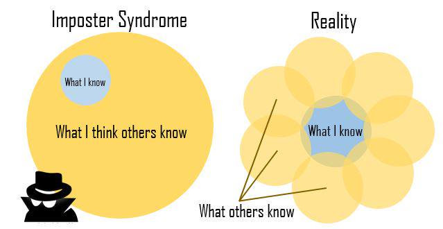
<figcaption>Imposter Syndrome in Data Science - Caitlin Hudon</figcaption>

 '일잘러'가 되고 싶어서 제가 하는 노력: 업무 관련 책을 읽고, 뉴스레터를 구독합니다. 해외 컨퍼런스 영상을 보고, 웨비나(Webinar)를 듣습니다. 업계 구루(Guru)들의 블로그에 수시로 들어가서 글을 읽고, 그들이 추천하는 책을 읽습니다. 비싼 돈을 내고 강의를 듣기도 합니다.

 쉴 새 없이 공부하지만 일잘러의 길은 아득히 멀기만 합니다. 배울 것은 끝이 없는데 공부할 시간은 부족하기에, 늘 지식과 역량의 결핍을 느낍니다. Medium에서 능력자들의 글을 읽고 있자면, 저는 도저히 이들과 같은 수준에서 경쟁할 수 없을 것 같습니다.

 지금까지 어찌어찌 버틴 것은 순전히 제 업무가 동료들에게는 생소한 분야라서, 아직 제 밑천이 드러나지 않은 덕분이라는 생각을 해 봅니다. 언젠가 이 분야를 잘 아는 동업자에게 '제대로 걸려서' 저의 얕은 바닥이 파헤쳐지면 어쩌나 하는 두려움도 있습니다.

 지난 몇 년 동안 이런 불안감이 제 마음속에 은은히 깔려 있었는데 (이런 심리 상태를 사기꾼 증후군 Imposter syndrome이라 부르더군요), 얼마 전 아래와 같은 글을 읽었습니다.

 "저는 사기꾼 증후군(Imposter syndrome)을 이런 식으로 극복해 왔습니다. 제가 데이터 사이언스의 모든 것(모든 알고리즘, 기술, 멋진 패키지, 프로그래밍 언어 등)을 배울 수는 없을 것이라는 점, 그리고 그래도 괜찮다는 점을 받아들였습니다.(중략) '당신이 아는 것'과 '다른 사람들이 아는 것' 사이의 관계를 잘 보여주는 벤 다이어그램이 있습니다. '당신이 아는 것'은 '다른 사람들이 아는 것'의 부분집합이 아닙니다. 당신의 지식은 다른 사람들의 지식과 겹치기도 하지만, 동시에 당신을 다른 사람들로부터 돋보이게 만들기도 합니다."

 이 말과 벤 다이어그램이 제게는 마음의 위안이 되었습니다. 그리고 이 분야에서 얼마나 많은 사람이 사기꾼 증후군을 겪는지 알고 나니 불안이 한결 가시는 기분이었습니다. 역설적이지만, 전 세계의 동업자들이 저와 같은 고민과 불안을 가지고 있다는 사실만큼 위로가 되는 일이 또 있을까요.

 PUBLY 독자 여러분 중에도 '내가 잘 하고 있는 것이 맞는지' 확인 받을 길이 없어서 불안하신 분, 자신의 역량이 부족하다는 생각에 시달리시는 분이 많으리라 생각합니다. 그런 분들께 이 벤 다이어그램이 위로를 드릴 수 있었으면 합니다. 안 그런 척 했지만, 다른 사람들도 사실 마찬가지라고 하니까요.

## +2)

 컨퍼런스는 모두 영어로 진행되는데... 스피커 자체가 다국적이라 악센트도 인도식/영국식/호주식/태국식/아이슬란드식 제각각이라 영어가 영어가 아닌 경우가 많이 있었습니다... 사실 세션 자체는 모두 녹화되어서 공유되지만,  미국식 영어도 다 알아듣기 어려운 와중에 정체불명 악센트들이 난무하니 더 어렵더라구요 @_@ 다양한 악센트에 대한 마음의 준비가 필요했습니다..

## +3)
 Amazon이 컨퍼런스 스폰서로 참여하지 않기 때문에 aws 관련 토크는 주최측에서 걸러버린다고 합니다. 보통 티켓을 사는 시점에는 스피커 목록은 공개되지 않은 경우가 많아서, 스폰서로 어디어디가 참여하나-를 보는 것도 좋지 않을까 싶어요

----

2018년 2월 [네이버 포스트에 작성한 글](http://naver.me/xaPYTEuu)을 옮겨온 포스트입니다.

