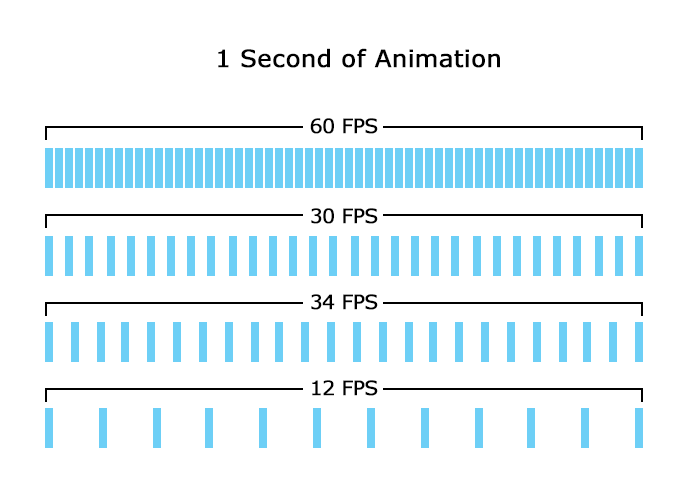
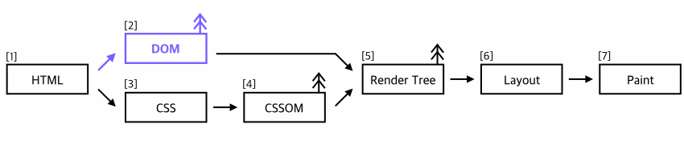
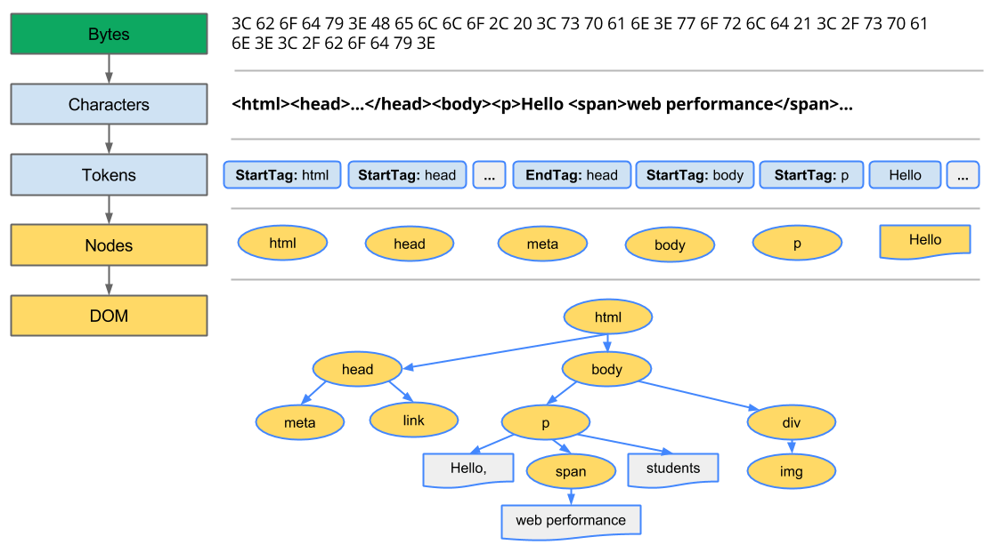
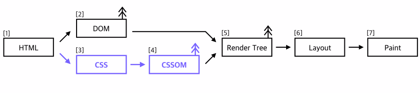
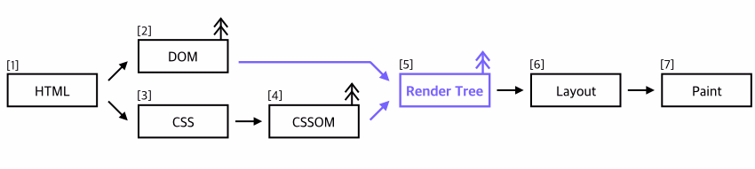
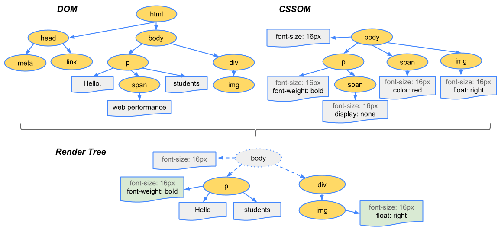
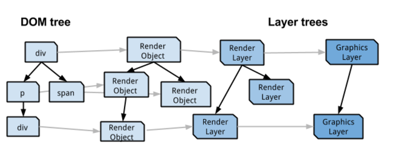
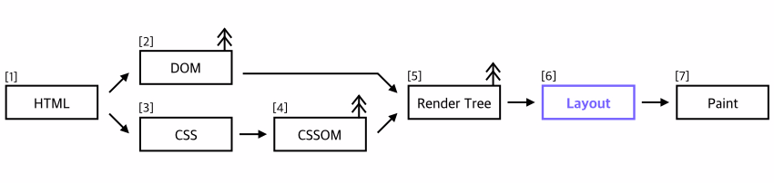
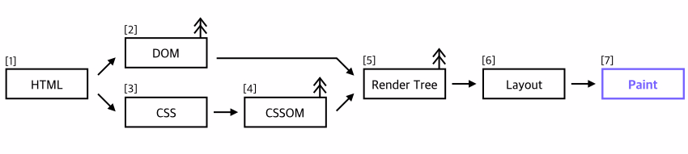

## 이걸 왜 알아야 하죠?

결론부터 말하자면 사용자가 웹페이지를 볼 때 거슬리는 일이 일어나지 않도록 만들기 위해 브라우저가 웹페이지를 그려내는 과정에 대한 지식이 필요할 수 있습니다. 물론 단순히 '거슬리지 않는' 수준이 아니라 최종적으로는 매끈한 사용자 경험을 만들기 위해서라 할 수도 있고요.

 

요즈음의 일반적인 스크린은 1초에 화면을 60번 그린다고 합니다. 그러니까 60fps(frame per second)인 것인데, 이 때문에 브라우저 역시 60fps를 유지해야 웹페이지가 매끄럽게 보일 수 있습니다. 실제 기기의 스크린이 업데이트되는 속도에 맞춰야 하니까요. 

만약 브라우저가 1초에 60프레임을 그려내지 못하게 되면, 웹페이지에서 스크롤을 내린다거나 드래그해서 뭔가를 움직인다거나 할 때 버벅버벅거리는 현상이 생기게 됩니다. (이러한 현상을 쟁크Jank라고 합니다.) 혹은 애초에 페이지 자체가 뜨는 데까지 하세월이 걸릴 수도 있습니다. 어느 쪽이든 썩 즐거운 상태는 아니겠죠. 그럴 때 최적화(Optimization)가 필요합니다. 

---

## 그런데, 뭘 최적화해야 하죠??

다짜고짜 최적화라니, 대체 뭘 어디에 최적화 시켜야 하는 것이죠??     

브라우저가 1초에 60프레임을 그릴 수 있으려면, 1개의 프레임을 그릴 때 약 0.016초(16ms)를 사용해야 합니다. 이보다 오래 걸린다면 60번 그리기 전에 1초가 끝나버리겠죠....sad... 그러니 페이지가 빠르게 뜨고, 버벅거리지 않도록 하려면 먼저 브라우저가 그 페이지의 하나의 프레임을 어떻게, 얼마동안 그리는지 알아보아야 합니다. 그리고 그 과정에서 시간이 오래걸리는 단계를 좀 더 효율적으로 바꿔 최대한 한 프레임을 빠르게 그려낼 수 있도록 만들면, 매끈한 웹페이지 완성! ~~(...이라고 정리하는데 밥아저씨가 생각나는 이유는 뭘까요..)~~

브라우저가 하나의 화면을 그려내는 이 과정을 중요 렌더링 경로(Critical Rendering Path)라고 부릅니다. 우리가 일상적으로 접하는 주소창에 url을 입력하고, 엔터키를 치면 브라우저는 해당 서버에 요청(request)을 보내게 됩니다. 서버에서는 응답(response)으로 HTML 데이터를 내려주는데, 이 HTML 데이터를 실제 우리가 보는 화면으로 그리기까지 브라우저는 다음 단계를 거쳐 작업을 진행합니다. 이 과정의 각 단계가 최대한 효율적으로 이루어지도록 만드는 것을 보통 최적화라고 부릅니다.


- 1 서버에서 응답으로 받은 HTML 데이터를 파싱한다.
- 2 HTML을 파싱한 결과로 DOM Tree를 만든다.
- 3 파싱하는 중 CSS 파일 링크를 만나면 CSS 파일을 요청해서 받아온다.
- 4 CSS 파일을 읽어서 CSSOM(CSS Object Model)을 만든다.
- 5 DOM Tree와 CSSOM이 모두 만들어지면 이 둘을 사용해 Render Tree를 만든다.
- 6 Render Tree에 있는 각각의 노드들이 화면의 어디에 어떻게 위치할 지를 계산하는 Layout과정을 거쳐서,
- 7 화면에 실제 픽셀을 Paint한다.

각 단계를 좀 더 살펴보자면,

---


## 서버에서 응답으로 받은 HTML 데이터를 파싱한다


```html
<html>
<head>
	<meta charset="utf-8">
	<link href="./style.css" rel="stylesheet">
</head>
<body>
    <p>Hello, <span>web performance</span> students</p>
    <div>
        
    </div>
</body>
</html>
```

 앞서 언급했듯이, 브라우저 주소창에 url을 입력하고 엔터키를 치면 브라우저는 해당 서버에 요청을 보내게 됩니다. 요청에 대한 응답으로는 위와 같은 형태의 HTML문서를 받아오게 되고, 이걸 하나하나 `파싱parsing`하기 시작하면서 브라우저가 데이터를 화면에 그리는 과정이 시작됩니다.

- 미디어 파일을 만나면 추가로 요청을 보내서 받아옵니다.
-  JavaScript 파일을 만나면 해당 파일을 받아와서 실행할 때까지 파싱이 멈춥니다.


## HTML에서 DOM Tree로




<figcaption>https://developers.google.com/web/fundamentals/performance/critical-rendering-path/constructing-the-object-model?hl=ko</figcaption>

 브라우저는 읽어들인 HTML 바이트 데이터를, 해당 파일에 지정된 인코딩(ex.UTF-8)에 따라 문자열로 바꾸게 됩니다.
 바꾼 문자열을 다시 읽어서, HTML표준에 따라 문자열을 토큰Token으로 변환합니다. 이미지에서와 같이 이 과정에서 <html> 은 StartTag: html 로,  </html> 은 EndTag: html 로 변환됩니다.

 이렇게 만들어진 토큰들을 다시 노드로 바꾸는 과정을 거칩니다. StartTag: html 이 들어왔으면 html노드를 만들고 EndTag:html 을 만나기 전까지 들어오는 토큰들은 html노드의 자식 노드로 넣는 식으로 변환이 이루어지기 때문에, 과정이 끝나면 Tree모양의 **DOM(Document Object Model)**이 완성되게 됩니다.


## CSS에서 CSSOM으로



 HTML을 파싱하다가 CSS링크를 만나면, CSS파일을 요청해서 받아오게 됩니다.
 받아온 CSS파일은 HTML을 파싱한 것과 유사한 과정을 거쳐서 역시 Tree형태의 **CSSOM**으로 만들어집니다. CSS 파싱은 CSS 특성상 자식 노드들이 부모 노드의 특성을 계속해서 이어받는(cascading) 규칙이 추가된다는 것을 빼고는 HTML파싱과 동일하게 이루어집니다.

 이렇게 CSSOM을 구성하는 것이 끝나야, 비로소 이후의 Rendering 과정을 시작할 수 있습니다. (그래서 CSS는 rendering의 blocking 요소라고 합니다.)


## DOM(Content) + CSSOM(Style) = Render Tree



CSSOM을 모두 만들었으면, DOM과 CSSOM를 합쳐서 Render Tree를 만듭니다. Render Tree는 DOM Tree에 있는 것들 중에서 화면에 실제로 **'보이는'** 친구들만으로 이루어집니다. 만약 CSS에서 `display: none` 으로 설정하였다면, 그 노드(와 그 자식 노드 전부)는 Render Tree에 추가되지 않는 것이죠. 마찬가지로 화면에 보이지 않는 `<head>` 태그 안의 내용들도 Render Tree에는 추가되지 않습니다.

 그래서 아래 이미지의 Render Tree에는 `<head>` 태그와, display속성이 none인 `<p>` 태그 하위의 `<span>` 태그가 사라진 것을 확인할 수 있습니다.


<figcaption>https://developers.google.com/web/fundamentals/performance/critical-rendering-path/render-tree-construction?hl=ko</figcaption>


 DOM과 CSSOM을 참조해서 Render Tree를 만드는 과정샷이 궁금하다면 [Udacity강의](https://www.udacity.com/course/website-performance-optimization--ud884)의 일부인 아래 영상을 참고!

<iframe width="560" height="315" src="https://www.youtube.com/embed/lvb06W_VKVE" frameborder="0" allow="accelerometer; autoplay; clipboard-write; encrypted-media; gyroscope; picture-in-picture" allowfullscreen></iframe>

<figcaption>The Render Tree - Website Performance Optimization</figcaption>


## Render Object에서 Render Layer로

Render Tree에는 사실 여러 가지가 포함되어 있습니다. Render Object Tree, Render Layer Tree 등등을 합쳐서 화면을 그리는 데에 필요한 모-든 정보를 가지고 있는 Render Tree가 완성됩니다. ('등등'에는 Render Style Tree, InlineBox Tree같은 것들도 있습니다.).   


<figcaption>https://www.chromium.org/developers/design-documents/gpu-accelerated-compositing-in-chrome</figcaption>

**Render Object Tree**가 위에서 말했듯이 DOM Tree의 노드 중에서 화면에 보이는 것들만으로 이루어지는 트리입니다. block, inline, image, text, table같은 요소들이 Render Object가 됩니다. DOM Tree에서 `<div>`는 Render Object Tree에 Block element로, `<span>`은 Inline element로 옮겨지는 것이졍

Render Object의 속성에 따라 필요한 경우 **Render Layer**가 만들어집니다. 그리고 이 Render Layer중에서 GPU에서 처리되는 부분이 있으면 다시 **Graphic Layer**로 분리됩니다. 대표적으로는 다음과 같은 속성들이 쓰였을 때 Graphic Layer가 만들어지게 됩니다. ('하드웨어 가속'을 사용할 수 있게 되어 성능을 좋게 한다고 할 때가 요때입니다. 자세한 내용은 [여기](http://d2.naver.com/helloworld/2061385)로)

- CSS 3D Transform(translate3d, preserve-3d 등)이나 perspective 속성이 적용된 경우
- `<video>` 또는 `<canvas>` 요소
- CSS3 애니메이션함수나 CSS 필터 함수를 사용하는 경우
- 자식 요소가 레이어로 구성된 경우
-  z-index 값이 낮은 형제 요소가 레이어로 구성된 경우

만약 이런거 저런거 하나도 없이 `<div>`하나에 width정도 속성만 있다고 하면 레이어는 기본으로 만들어지는 하나만 사용하게 됩니다.


## Layout(reflow)



 화면에 보이는 노드들만을 가지고 있는 Render Tree가 다 만들어지면, 이제 Render Tree에 있는 각각의 노드들이 화면의 어디에 위치할 지를 계산하는 Layout과정을 거칩니다. CSSOM에서 가져온 스타일 정보들로 이미 얘가 어떻게 생겨야 한다는 것은 모두 알고 있지만, 그래서 현재 보이는 뷰포트를 기준으로 실제로 놓으려면 얘가 어디에 가야하는 지는 계산을 또 해야하는 거죠. 여기에서 CSS box model이 쓰이며, position(relative, absolute, fixed..), width, height 등등 틀과 위치에 관련된 부분들이 계산됩니다.

 만약 width: 50% 로 되어있는데 브라우저를 리사이즈한다고 하면, 보이는 요소들은 변함이 없으니 Render Tree는 그대로인 상태에서, layout단계만 다시 거쳐 위치를 계산해서 그리게 됩니다.  


<figcaption>요런 경우, 같은 렌더 트리를 가지고 layout(과 이후 paint)단계부터 다시 거칩니다</figcaption>


이렇게 화면에 보이는 요소 각각이 어디에 어떻게 위치할 지를 정해주는 과정을 Webkit에서는 layout으로, Gecko에서는 reflow로 부르고 있습니다.    


## Paint(repaint)



 그리고 드디어 Render Tree의 각 노드들을 실제로 화면에 그리게 됩니다..!     
 visibility, outline, background-color같이 정말로 눈에 보이는 픽셀들이 여기에서 그려집니다.    

 만약 Render Layer가 2개 이상이라면 각각의 Layer를 paint한 뒤 하나의 이미지로 Composite하는 과정을 추가로 거친 뒤에 실제로 화면에 그려지게 됩니다.
(Gecko에서 reflow를 거쳐서 화면에 paint되기까지를 보여주는 영상이 있어서 추가로 붙여둡니다.).   

<iframe width="560" height="315" style="margin-left:auto;margin-right:auto;position:absolute" src="https://www.youtube.com/embed/ZTnIxIA5KGw" frameborder="0" allow="accelerometer; autoplay; clipboard-write; encrypted-media; gyroscope; picture-in-picture" allowfullscreen></iframe>

<figcaption>Gecko Reflow Visualization - mozilla.org</figcaption>


## 참고자료

아래 영상&아티클을 참고하였습니다.

차근차근 알려주기로는 Udacity 강의가 제일..! (한글 자막도 제공!)
[Udacity - Website Performance Optimization](https://www.udacity.com/course/website-performance-optimization--ud884)

그 다음으로는 이 아저씨 발표. (썸네일보다 착하게 생겼어요)

<iframe width="560" height="315" src="https://www.youtube.com/embed/SmE4OwHztCc" frameborder="0" allow="accelerometer; autoplay; clipboard-write; encrypted-media; gyroscope; picture-in-picture" allowfullscreen></iframe>


이건 얼마 못 알아들었지만 Webkit 커미터인 구글러...

<iframe width="560" height="315" src="https://www.youtube.com/embed/RVnARGhhs9w" frameborder="0" allow="accelerometer; autoplay; clipboard-write; encrypted-media; gyroscope; picture-in-picture" allowfullscreen></iframe>


영상 말고 아티클로는,    
일단 구글에서 마치 가이드처럼 제공하고 있는 웹 성능 문서.
- https://developers.google.com/web/fundamentals/performance/critical-rendering-path/?hl=ko


+a
- https://afasterweb.com/2015/08/29/what-the-jank/
- https://www.html5rocks.com/ko/tutorials/speed/layers/
- http://d2.naver.com/helloworld/59361
- https://github.com/nhnent/fe.javascript/wiki/Reflow와-Repaint
- http://www.mimul.com/pebble/default/2013/07/07/1373183724195.html
- http://donggov.tistory.com/56
- http://d2.naver.com/helloworld/2061385
- https://www.chromium.org/developers/design-documents/-gpu-accelerated-compositing-in-chrome

그리고...끝판왕스러운 마지막 아티클
- https://www.html5rocks.com/en/tutorials/internals/howbrowserswork/ 

---

2017년 6월 [네이버 포스트에 작성한 글](https://post.naver.com/viewer/postView.nhn?volumeNo=8431285&memberNo=34176766)을 옮겨온 포스트입니다.